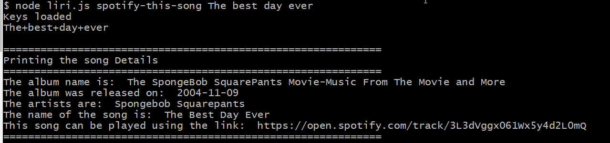
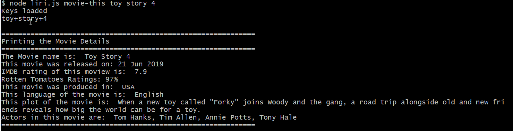
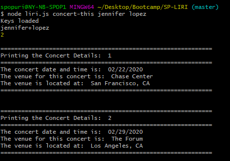
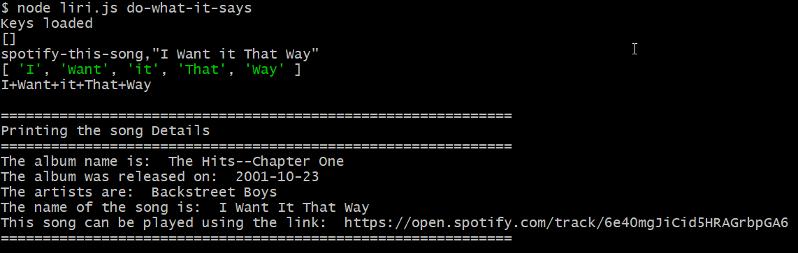

## LIRI bot by Swarupa Popuri
Hello. Welcome to LIRI bot. 

You can use my LIRI to any of the following. 

    1. Search spotify to find details of your favorite song using spotify-this-song command
    2. Search for movie details of any movie using movie-this command
    3. Search for concerts around town or search for an artist performing near you using concert-this command.
    4. Search for something random that is defined in random text file using do-what-it-says command. 

To develop this bot, I have used several NPM modules. I have listed them below.

    1. node-spotify-api
    2. axios
    3. fs
    4. moment.js

In addition to the NPM modules mentioned above, I have used the following APIs.

    1. OMDB movie search. 
    2. Bands in town.

My bot was developed using javaScript, node.js. 

## How to use my LIRI bot:

1. spotify-this-song: To search for a song, all you need to do is to run the following command in your command line interface.

2. movie-this: To search for a movie, run the following command in your command line interface.

3. concert-this: To search for concerts of a band or an artist, run the following command in your command line interface.

4. do-what-it-says: To run something from a local text file, run the following command in your command line interface.

